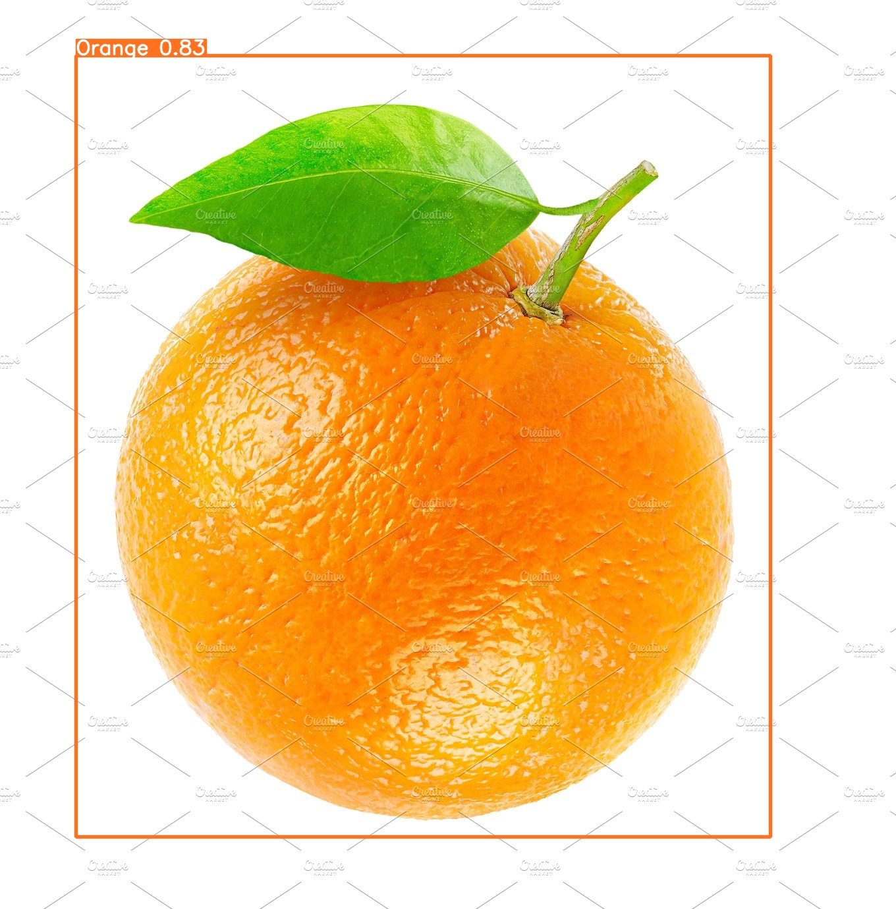
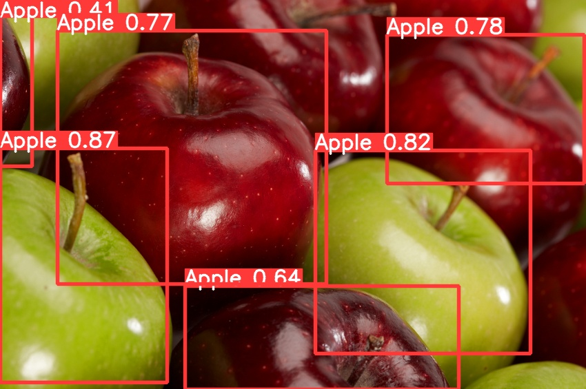
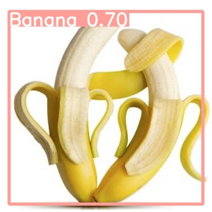

# Fruits-Object-Detection
This is an Object Detection project using YolovV5 to detect apples, bananas and oranges in an image or video.

## Project Description
The main goal of this project, was to train an object detection model to distinguish between different fruits using a custom dataset built using samples collected from the internet. I did this project, to increase my experience in Machine Learning and to understand the various fields in AI to get a good grasp on it. Object Detection is something I liked and wanted to use in a project of my own.

## What to Install
Clone the github repo of YOLOv5 from the Ultralytics github page and setup a google colab environment for training, and you should be good to go.

## How to run the project
You can follow the steps in the jupyter notebook to replicate the workflow and in addition to that, you'll need to change the file paths in the yaml file located in the data subdirectory of the YOLOv5 folder to point to your training, validation and testing (optional) data rspectively. 

## Credits
I'd like to give credit to the following link for helping me through this project:

[YOLOv5 object detection](https://youtu.be/GRtgLlwxpc4)

## Results

